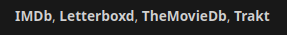

# jellyfin-letterboxd

A simple plugin to add Letterboxd to a movie's external links

## Installation
1. Go to `Dashboard -> Plugins` and select the `Repositories` tab
2. Add a new repository with the following details:
- Repository name: `Letterboxd`
- Repository URL: `https://raw.githubusercontent.com/fawni/jellyfin-letterboxd/master/manifest.json`
3. Go to the `Catalog` tab
4. Find `Letterboxd` in the `Metadata` section (or search for it) and install it
5. Restart Jellyfin to apply the changes

## License

[Apache-2.0](LICENSE)
